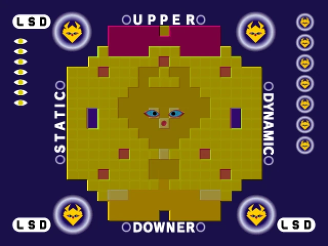

# 🌙 Dream Interpreter

A dream interpretation application that uses NLP techniques to analyse dreams on two dimensions and generates evolving symbolic representations.

## Live Application

**[Dream Interpreter Application](https://dreamanalyser-production.up.railway.app/)**

## Background and Inspiration

This application draws inspiration from **[Little Sweet Dream Emulator](https://en.wikipedia.org/wiki/LSD:_Dream_Emulator)**, a PlayStation game created by Japanese artist Osamu Sato. The game was based on dream journal that spanned 10 years, and features players walking through procedurally generated dreamscapes. After experiencing each dream sequence, the game would plot the dream on a two-dimensional graph, categorising it as "Upper" or "Downer" (emotional valence) and "Static" or "Dynamic" (energy level).



The Dream Interpreter extends this concept into an interactive tool where users can map their own dreams onto similar emotional and dynamic axes. Rather than simply plotting points on a graph, the application generates evolving symbolic representations that change based on the cumulative emotional and dynamic patterns of a user's dreams.


The symbol generation draws from the psychological concepts of **active imagination** and **mandala work** - the idea that visual symbols can serve as containers for psychological meaning and transformation. As users continue to input dreams, their personal symbol evolves in complexity, color, and form, creating a unique visual representation of their inner landscape over time.

## Features

- **Dual-Axis Dream Analysis**: Maps dreams on emotional (Upper/Downer) and energy (Static/Dynamic) dimensions
- **NLP-Powered Processing**: Uses TextBlob sentiment analysis combined with keyword matching
- **Evolving Symbol Generation**: Creates unique matplotlib-based symbols that grow more complex as you add dreams
- **User Tracking**: Maintains dream history and statistics per user
- **Web Interface**: Clean, intuitive interface for dream entry and visualisation
- **RESTful API**: Complete API for integration with other applications
- **Real-time Analysis**: Instant dream interpretation with confidence scoring
- **Statistical Insights**: Aggregated user statistics and dominant pattern identification

## Technology Stack

- **Backend**: FastAPI with Python 3.11
- **Web Server**: Uvicorn ASGI server
- **Data Validation**: Pydantic for request/response models and type safety
- **NLP**: TextBlob for sentiment analysis
- **Visualization**: Matplotlib for dynamic symbol generation
- **Testing**: Pytest with 83% test coverage
- **Containerisation**: Docker
- **CI**: GitHub Actions with automated testing, linting, and Docker builds
- **Code Quality**: 
  - Black for code formatting
  - isort for import organization
  - Pylint for static analysis
- **Deployment**: Railway
- **Development**: Poetry for dependency management

## Quick Start

### Prerequisites

- Python 3.9+
- Poetry
- Docker

### Local Development
```bash
# Clone the repository:
git clone https://github.com/Chazzy11/dream_analyser.git

# Install dependencies:
make install

# Download required NLP data:
make setup-nltk

# Run the development server:
make run
```
Visit [http://localhost:8000](http://localhost:8000) to access the application.

### Docker

```bash
# Build and run with Docker
make docker-build
make docker-run
```

The application will be available at [http://localhost:8000](http://localhost:8000).

### Manual Setup (without Make)

If you prefer not to use the Makefile:

```bash
# Install dependencies
poetry install

# Download NLTK data
poetry run python -c "import nltk; nltk.download('punkt', quiet=True)"
poetry run python -c "import nltk; nltk.download('brown', quiet=True)"

# Run the application
poetry run uvicorn dream_interpreter.main:app --reload --host 127.0.0.1 --port 8000
```

## License

MIT License. See [LICENSE](LICENSE) for full details.